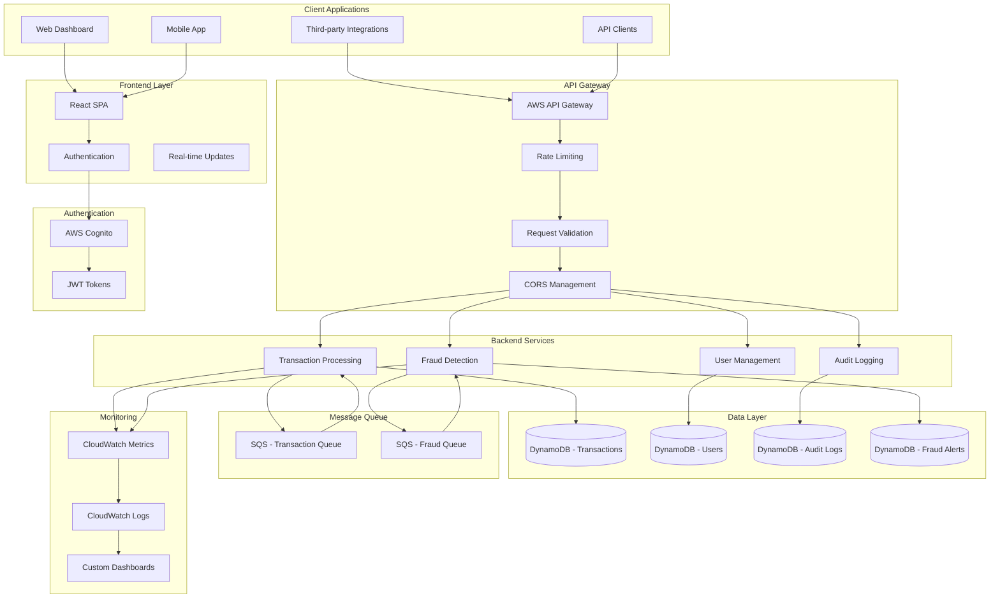
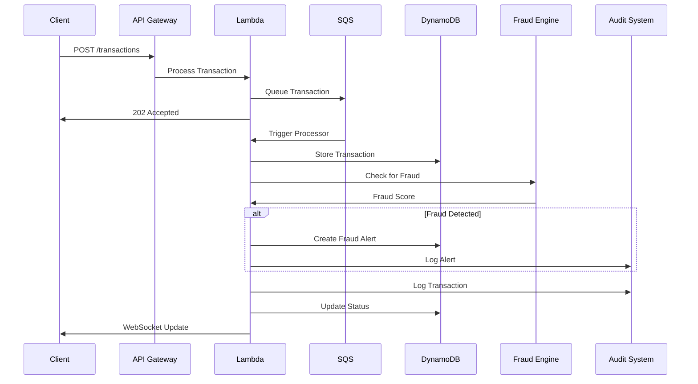
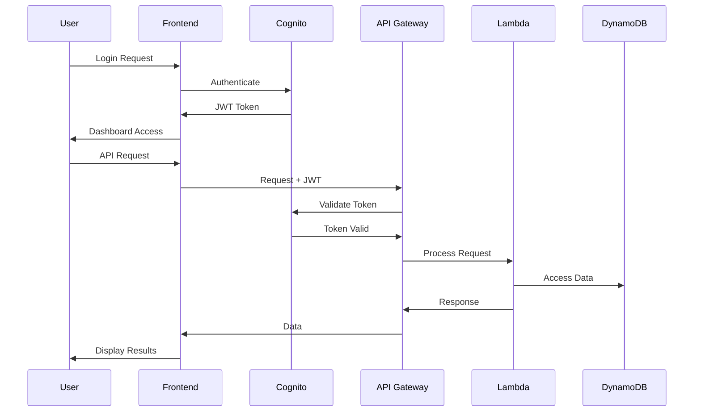

# Tranzor - Real-Time Financial Transaction Processing Platform

Tranzor is a serverless, real-time financial transaction processing system designed to address the scalability, security, and performance challenges faced by financial institutions. Built with modern cloud-native technologies, Tranzor provides comprehensive transaction monitoring, fraud detection, and audit capabilities.

## 🎯 Project Overview

Tranzor enables financial institutions to:
- **Process transactions in real-time** with sub-100ms latency
- **Detect fraud automatically** using AI-powered scoring algorithms
- **Maintain complete audit trails** for compliance and security
- **Scale seamlessly** from hundreds to millions of transactions per day
- **Monitor system health** with comprehensive metrics and alerting

## 🏗️ System Architecture

### High-Level Architecture


### Real-Time Transaction Flow


### Authentication & Security Flow


## 📁 Project Structure

```
Tranzor/
├── frontend/                    # React-based web application
│   ├── src/
│   │   ├── components/         # Reusable UI components
│   │   ├── pages/             # Page components
│   │   ├── store/             # Redux store and API slices
│   │   ├── services/          # API services and mock data
│   │   ├── hooks/             # Custom React hooks
│   │   └── contexts/          # React contexts
│   ├── public/                # Static assets
│   └── package.json           # Frontend dependencies
├── backend/
│   └── tranzor-api/           # AWS SAM backend application
│       ├── src/               # Lambda function source code
│       ├── events/            # Test events
│       ├── __tests__/         # Unit tests
│       ├── template.yml       # AWS SAM template
│       └── package.json       # Backend dependencies
├── docs/                      # Documentation
├── scripts/                   # Deployment and utility scripts
└── README.md                  # This file
```

## 🚀 Key Features

### Frontend Features
- **Real-time Dashboard**: Live transaction monitoring and metrics
- **Transaction Management**: Create, view, and manage transactions
- **Fraud Alert System**: Monitor and investigate fraud alerts
- **Audit Trail**: Complete system activity logging
- **User Management**: Secure authentication and user settings
- **Mock Data System**: Comprehensive testing environment

### Backend Features
- **Serverless Architecture**: AWS Lambda-based microservices
- **Real-time Processing**: SQS-based message queuing
- **Fraud Detection**: AI-powered scoring algorithms
- **Audit Logging**: Complete activity tracking
- **Auto-scaling**: Automatic resource scaling
- **High Availability**: Multi-AZ deployment

### Security Features
- **AWS Cognito**: Secure user authentication
- **JWT Tokens**: Stateless authentication
- **Encryption**: Data encrypted at rest and in transit
- **IAM Roles**: Least privilege access control
- **API Security**: Rate limiting and validation

## 🛠️ Technology Stack

### Frontend
- **React 18**: Modern UI framework
- **Vite**: Fast build tool and dev server
- **Ant Design**: Enterprise UI component library
- **Redux Toolkit**: State management
- **RTK Query**: API data fetching
- **React Router**: Client-side routing
- **AWS Cognito**: Authentication

### Backend
- **AWS SAM**: Serverless application model
- **AWS Lambda**: Serverless compute
- **Amazon DynamoDB**: NoSQL database
- **Amazon SQS**: Message queuing
- **API Gateway**: REST API management
- **AWS Cognito**: User authentication
- **CloudWatch**: Monitoring and logging

### DevOps
- **AWS CloudFormation**: Infrastructure as code
- **Jest**: Testing framework
- **ESLint**: Code linting

## 📊 Performance Metrics

### Scalability Targets
- **Throughput**: 10,000+ transactions per second
- **Latency**: < 100ms for transaction processing
- **Availability**: 99.9% uptime SLA
- **Concurrent Users**: 10,000+ simultaneous users

### Monitoring & Alerting
- **Real-time Metrics**: Transaction rate, latency, error rates
- **System Health**: Lambda function performance, queue depth
- **Business Metrics**: Fraud detection rate, transaction volume
- **Custom Dashboards**: Operational and business intelligence

## 🔧 Getting Started

### Prerequisites
- Node.js 18+
- AWS CLI configured
- AWS SAM CLI

### Quick Start

1. **Clone the Repository**
   ```bash
   git clone https://github.com/your-org/tranzor.git
   cd tranzor
   ```

2. **Frontend Setup**
   ```bash
   cd frontend
   npm install
   cp env.example .env.local
   # Update .env.local with your AWS Cognito settings
   npm run dev
   ```

3. **Backend Setup**
   ```bash
   cd backend/tranzor-api
   npm install
   sam build
   sam deploy --guided
   ```

4. **Access the Application**
   - Frontend: http://localhost:5173
   - Backend API: Available via AWS API Gateway

## 🧪 Testing

### Frontend Testing
```bash
cd frontend
npm test                    # Unit tests
npm run test:coverage      # Coverage report
npm run test:e2e          # End-to-end tests
```

### Backend Testing
```bash
cd backend/tranzor-api
npm test                   # Unit tests
sam local start-api       # Local API testing
sam local invoke          # Lambda function testing
```

### Integration Testing
```bash
# Run full integration tests
npm run test:integration
```

## 📈 Deployment


### Production Environment
- Manual deployment from `main` branch
- Blue-green deployment strategy
- Comprehensive monitoring and alerting

### Environment Configuration
```bash
# Development
npm run deploy:dev

# Staging
npm run deploy:staging

# Production
npm run deploy:prod
```

## 🔒 Security & Compliance

### Data Protection
- **Encryption**: AES-256 encryption at rest, TLS 1.2+ in transit
- **Access Control**: Role-based access control (RBAC)
- **Audit Logging**: Complete activity tracking
- **Compliance**: SOC 2, PCI DSS, GDPR ready

---

**Tranzor** - Powering the future of financial transaction processing with modern, scalable, and secure technology.

*Built with ❤️ by the Tranzor team*
