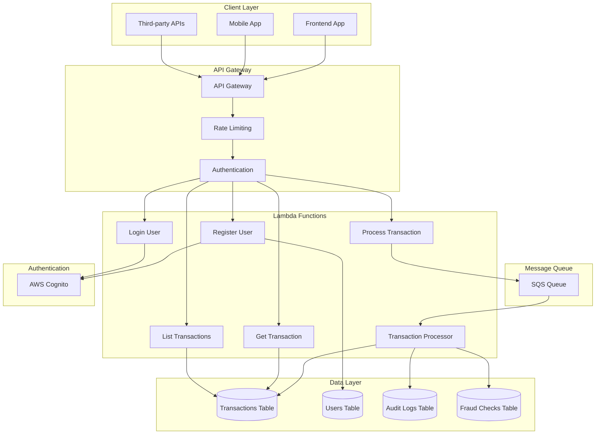
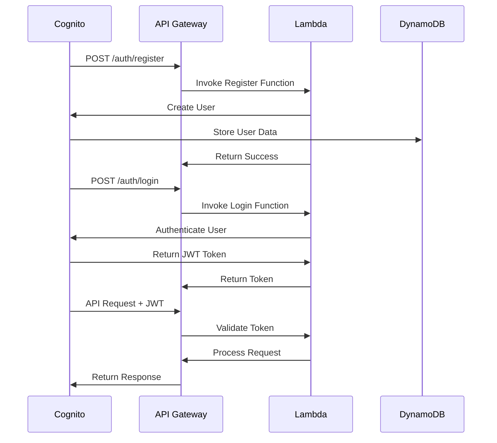

# Tranzor API - Backend Service

A serverless, real-time financial transaction processing API built with AWS SAM, designed to handle high-volume transaction processing with fraud detection and audit capabilities.

## 🏗️ Architecture Overview

Tranzor API is built on AWS serverless architecture using:

- **AWS Lambda** for compute
- **Amazon DynamoDB** for data storage
- **Amazon SQS** for message queuing
- **API Gateway** for REST API endpoints
- **AWS Cognito** for authentication
- **CloudWatch** for monitoring and logging

## 🚀 Features

### ✅ Core Functionality
- **Real-time Transaction Processing**: High-throughput transaction ingestion and processing
- **Fraud Detection**: Automated fraud scoring and alert generation
- **Audit Trail**: Comprehensive logging of all system activities
- **User Management**: Secure authentication and authorization
- **Scalable Architecture**: Auto-scaling based on demand
- **High Availability**: Multi-AZ deployment with fault tolerance

### 🔒 Security & Compliance
- **AWS Cognito Integration**: Secure user authentication
- **DynamoDB Encryption**: Data encrypted at rest and in transit
- **IAM Roles**: Least privilege access control
- **API Gateway Security**: Request validation and throttling
- **Audit Logging**: Complete activity tracking for compliance

### 📊 Performance & Monitoring
- **Real-time Metrics**: Transaction throughput and latency monitoring
- **CloudWatch Integration**: Comprehensive logging and alerting
- **Auto-scaling**: Lambda functions scale automatically
- **Queue Management**: SQS for reliable message processing

## 🏛️ System Architecture



## 📁 Project Structure

```
tranzor-api/
├── src/
│   ├── auth/                    # Authentication handlers
│   │   ├── login.js            # User login
│   │   └── register.js         # User registration
│   ├── transaction_processor/   # SQS message processor
│   │   └── index.js            # Main processor logic
│   ├── process_transaction/     # Transaction creation
│   │   └── index.js            # POST /transactions
│   ├── get_transaction/         # Transaction retrieval
│   │   └── index.js            # GET /transactions/{id}
│   └── list_account_transactions/ # Account transactions
│       └── index.js            # GET /accounts/{id}/transactions
├── events/                      # Test events for local testing
├── __tests__/                   # Unit tests
├── template.yml                 # AWS SAM template
├── buildspec.yml               # AWS CodeBuild configuration
└── package.json                # Dependencies
```

## 🔧 API Endpoints

### Authentication
- `POST /auth/register` - User registration
- `POST /auth/login` - User authentication

### Transactions
- `POST /v1/transactions` - Create new transaction
- `GET /v1/transactions/{transactionId}` - Get transaction details
- `GET /v1/accounts/{accountId}/transactions` - List account transactions

### Response Format
```json
{
  "success": true,
  "data": {
    "transactionId": "TXN123456",
    "accountId": "ACC000001",
    "amount": 100.50,
    "currency": "USD",
    "status": "Pending",
    "timestamp": "2024-01-01T12:00:00Z"
  },
  "message": "Transaction processed successfully"
}
```

## 🚀 Deployment

### Prerequisites
- AWS CLI configured with appropriate permissions
- AWS SAM CLI installed
- Node.js 18+ installed
- Docker (for local testing)

### Quick Start

1. **Clone and Setup**
   ```bash
   cd backend/tranzor-api
   npm install
   ```

2. **Build the Application**
   ```bash
   sam build
   ```

3. **Deploy to AWS**
   ```bash
   sam deploy --guided
   ```

4. **Follow the prompts:**
   - Stack Name: `tranzor-api`
   - AWS Region: Choose your preferred region
   - Confirm changes: `y`
   - Allow IAM role creation: `y`
   - Save arguments: `y`

### Environment Variables

The following environment variables are automatically configured:

- `TRANSACTIONS_TABLE_NAME` - DynamoDB table for transactions
- `USERS_TABLE_NAME` - DynamoDB table for users
- `AUDIT_LOGS_TABLE_NAME` - DynamoDB table for audit logs
- `FRAUD_CHECKS_TABLE_NAME` - DynamoDB table for fraud checks
- `COGNITO_USER_POOL_ID` - AWS Cognito User Pool ID
- `COGNITO_USER_POOL_CLIENT_ID` - AWS Cognito Client ID

## 🧪 Testing

### Local Testing
```bash
# Start local API
sam local start-api

# Test endpoints
curl -X POST http://localhost:3000/auth/register \
  -H "Content-Type: application/json" \
  -d '{"email":"test@example.com","password":"Password123!"}'

curl -X POST http://localhost:3000/v1/transactions \
  -H "Content-Type: application/json" \
  -d '{"accountId":"ACC000001","amount":100.50,"currency":"USD"}'
```

### Unit Tests
```bash
npm test
```

### Integration Tests
```bash
# Deploy to test environment
sam deploy --config-env test

# Run integration tests
npm run test:integration
```

## 📊 Monitoring & Logging

### CloudWatch Metrics
- Transaction processing rate
- Lambda function duration and errors
- DynamoDB read/write capacity
- SQS queue depth

### CloudWatch Logs
- Lambda function execution logs
- API Gateway access logs
- Error tracking and debugging

### Alerts
- High error rates
- Queue depth thresholds
- Performance degradation

## 🔒 Security

### Authentication Flow


### Data Protection
- **Encryption at Rest**: All DynamoDB tables encrypted with AWS KMS
- **Encryption in Transit**: TLS 1.2+ for all API communications
- **Access Control**: IAM roles with least privilege principle
- **Audit Logging**: Complete activity tracking

## 📈 Performance

### Scalability
- **Auto-scaling**: Lambda functions scale from 0 to thousands of concurrent executions
- **Queue Management**: SQS handles message buffering and retry logic
- **Database Optimization**: DynamoDB auto-scaling with on-demand capacity

### Performance Targets
- **Latency**: < 100ms for transaction processing
- **Throughput**: 10,000+ transactions per second
- **Availability**: 99.9% uptime SLA
- **Durability**: 99.999999999% data durability

## 🛠️ Development

### Adding New Endpoints
1. Create new Lambda function in `src/`
2. Add function definition to `template.yml`
3. Configure API Gateway events
4. Add IAM permissions
5. Update tests

### Local Development
```bash
# Start local development
sam local start-api --env-vars env.json

# Watch for changes
sam build --use-container --watch
```

### Code Quality
- ESLint for code linting
- Prettier for code formatting
- Jest for unit testing
- Coverage reporting

## 🔄 CI/CD Pipeline

### AWS CodeBuild Integration
The project includes `buildspec.yml` for automated deployment:

```yaml
version: 0.2
phases:
  install:
    runtime-versions:
      nodejs: 18
  build:
    commands:
      - npm install
      - npm test
      - sam build
      - sam deploy --no-confirm-changeset
```

### Deployment Stages
1. **Development**: Automatic deployment on push to `develop` branch
2. **Staging**: Manual deployment from `staging` branch
3. **Production**: Manual deployment from `main` branch

## 🚨 Troubleshooting

### Common Issues

**Lambda Timeout**
- Increase timeout in `template.yml`
- Optimize function code
- Check DynamoDB performance

**CORS Errors**
- Verify CORS configuration in API Gateway
- Check frontend origin settings

**Authentication Failures**
- Verify Cognito configuration
- Check JWT token expiration
- Validate user pool settings

### Debug Commands
```bash
# View logs
sam logs -n ProcessTransactionFunction --stack-name tranzor-api --tail

# Test function locally
sam local invoke ProcessTransactionFunction --event events/event-post-transaction.json

# Check deployment status
aws cloudformation describe-stacks --stack-name tranzor-api
```

## 📚 Resources

- [AWS SAM Documentation](https://docs.aws.amazon.com/serverless-application-model/)
- [DynamoDB Best Practices](https://docs.aws.amazon.com/amazondynamodb/latest/developerguide/best-practices.html)
- [Lambda Performance Optimization](https://docs.aws.amazon.com/lambda/latest/dg/best-practices.html)
- [API Gateway Security](https://docs.aws.amazon.com/apigateway/latest/developerguide/security.html)

## 🤝 Contributing

1. Fork the repository
2. Create a feature branch
3. Make your changes
4. Add tests
5. Submit a pull request

---

**Tranzor API** - Powering the future of financial transaction processing with serverless technology.
